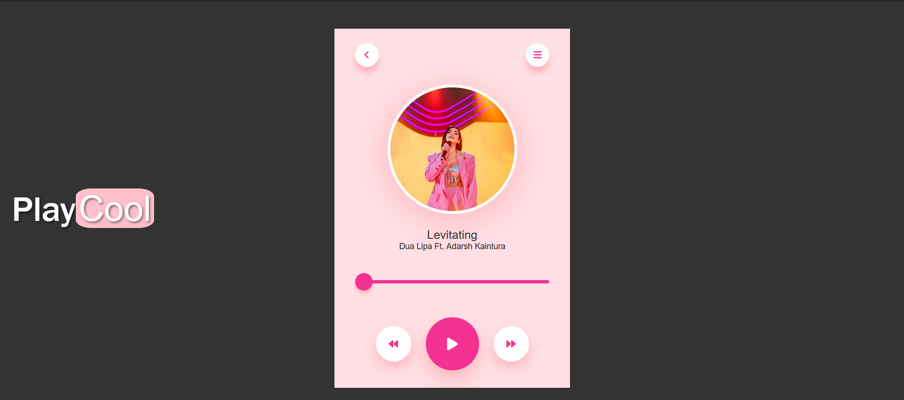

# 🎵 PlayCool Music Player

**PlayCool** is a modern and stylish web-based music player that allows you to play and control your favorite songs directly in your browser. It features a sleek design, rotating song artwork, and intuitive controls for playing, pausing, and skipping songs.



## 🌟 Features

- **Play/Pause**: Control playback with a single click.
- **Next/Previous**: Skip to the next or previous song.
- **Progress Bar**: Visual indicator of the song's progress.
- **Rotating Album Art**: Dynamic rotation effect for the currently playing song's artwork.
- **Responsive Design**: Works seamlessly on desktop and mobile devices.

## 📂 Project Structure

The project consists of three main files:

- **index.html**: The HTML structure of the music player.
- **style.css**: The styling for the music player.
- **script.js**: The JavaScript for controlling the music player functionality.

## 🔧 Installation

To run the project locally, follow these steps:

1. **Clone the repository:**
    ```bash
    git clone https://github.com/your-username/playcool-music-player.git
    ```
2. **Open `index.html`** in your favorite web browser.

## 📜 Usage

- Add your favorite songs by updating the `songs` array in `script.js`.
- Make sure your media files (images and songs) are in the correct directory.

## 🖼️ Images Used

- Song Artwork: 
  - `media/pinksing.jpg` for "Levitating" by Dua Lipa Ft. Adarsh Kaintura
  - `media/edsheeran.webp` for "Perfect" by Ed Sheeran
  - *(and so on for other songs)*

## 🎶 Adding New Songs

To add new songs to the player:

1. Add a new object to the `songs` array in `script.js`:
    ```javascript
    {
        title: "Song Title",
        artist: "Artist Name",
        image: "media/your-image.jpg",
        path: "media/your-song.mp3"
    }
    ```
2. Place your song files and images in the `media` folder.

## 🛠️ Built With

- **HTML**: For the structure of the music player.
- **CSS**: For styling and visual effects.
- **JavaScript**: For functionality and interactivity.

## 🤝 Contributing

Contributions, issues, and feature requests are welcome! Feel free to check the [issues page](https://github.com/your-username/playcool-music-player/issues).

## 📄 License

This project is licensed under the MIT License - see the [LICENSE.md](LICENSE.md) file for details.

## 📧 Contact

- **Your Name** - [Adarsh Kaintura](https://www.linkedin.com/in/adarsh-kaintura-08b096269/)
- **Project Link**: [Play-Cool](https://github.com/Adarshkaintura/playcool-music-player)

---

Enjoy your music with **PlayCool**! 🎵
